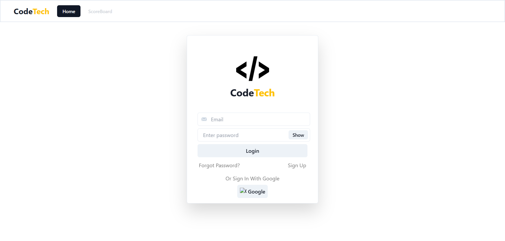
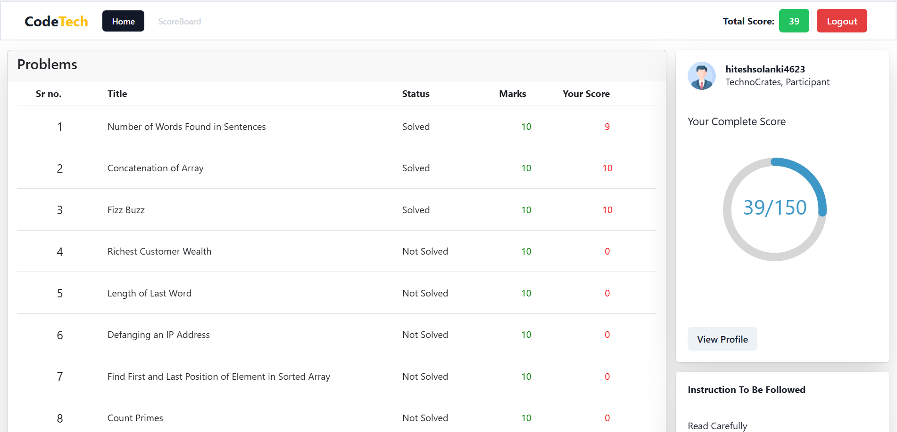
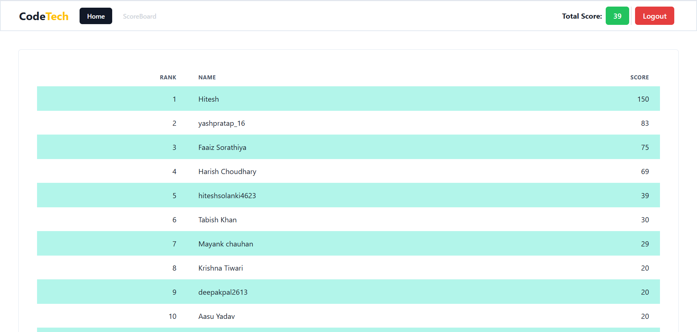

# 💻 Codetech – Competitive Coding Practice Platform

[Codetech](https://codetech-new.vercel.app/) is an interactive platform designed for competitive programmers and developers to solve coding challenges in a LeetCode-style environment. It supports real-time code editing, problem listings, and backend code execution for instant feedback.

🔗 **Live Site:** [https://codetech-new.vercel.app](https://codetech-new.vercel.app)
📦 **GitHub Repo:** [https://github.com/Hitesh-s0lanki/codetech_new](https://github.com/Hitesh-s0lanki/codetech_new)

---

## 🚀 What is Codetech?

> Codetech is built for aspiring programmers and students preparing for coding interviews and competitive exams. It simulates a real online judge with code editor, test case evaluation, and problem solving history.

It’s an ideal platform to:

- Practice algorithmic problems
- Test code across multiple languages
- Prepare for interviews

---

## 🧠 Features

- 📋 **Problem Listings** – Browse and choose from a set of algorithmic challenges.
- 🧑‍💻 **Code Editor** – Write code with syntax highlighting and basic autocompletion.
- ⚙️ **Code Execution** – Compile and run code with test inputs via server-side compiler function.
- 🔐 **Authentication & User Tracking** – Managed via Firebase.
- 🧾 **Submission History** – Track what you’ve solved (coming soon).

---

## 🛠️ Tech Stack

**Frontend:**

- React.js
- Context API for state management
- Tailwind CSS (if used for styling)

**Backend:**

- Firebase (Authentication + Firestore)
- Node.js (API + code execution backend)
- Custom compiler logic for real-time code evaluation

**Hosting:**

- Vercel

---

## 📸 Screenshots

> Add screenshots like:






---

## 🧰 Getting Started

### 1. Clone the Repository

```bash
git clone https://github.com/Hitesh-s0lanki/codetech_new.git
cd codetech_new
```

### 2. Install Dependencies

```bash
npm install
```

### 3. Set Up Environment Variables

Create a `.env.local` file and add Firebase keys and backend URL:

```env
REACT_APP_FIREBASE_API_KEY=your_key
REACT_APP_FIREBASE_AUTH_DOMAIN=your_project.firebaseapp.com
REACT_APP_FIREBASE_PROJECT_ID=your_project_id
REACT_APP_FIREBASE_STORAGE_BUCKET=your_project.appspot.com
REACT_APP_FIREBASE_MESSAGING_SENDER_ID=sender_id
REACT_APP_FIREBASE_APP_ID=app_id
REACT_APP_COMPILER_API_URL=http://your-backend-url/execute
```

### 4. Start the App

```bash
npm start
```

---

## 🔧 Code Execution Engine

Codetech uses a secure Node.js server to compile and run user-submitted code.

Sample flow:

- User writes code in the frontend
- Code is sent to a backend API
- Server runs the code inside a secure container (like Docker or isolated sandbox)
- Returns output or error logs

> You can extend this with support for C++, Python, Java, etc.

---

## 🔮 Future Roadmap

- 💬 Discussion section for each problem
- 🧪 Unit test support for more robust evaluations
- 📈 User profile and ranking system
- 🧠 AI code hints (powered by OpenAI)
- 📱 Mobile-friendly UI

---

## 🤝 Contributing

Feel free to fork, raise issues, or contribute pull requests! All improvements—UI, backend, security, or compiler optimization—are welcome.

---
